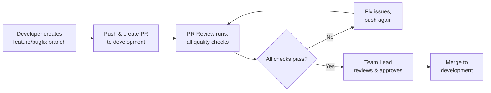

# Developer Workflow & CI/CD Guide

> **Last Updated:** February 2026  
> **Maintained by:** Team Lead

This document explains the complete development workflow, branching strategy, and automated CI/CD processes for the PixArt application.

---

## 📋 Table of Contents

- [Branch Strategy](#-branch-strategy)
- [Developer Workflow](#-developer-workflow)
- [Team Lead Workflow](#-team-lead-workflow)
- [Branch Flow & Promotion](#-branch-flow--promotion)
- [CI/CD Automation](#-cicd-automation)
- [Pull Request Guidelines](#-pull-request-guidelines)
- [Hotfix Emergency Process](#-hotfix-emergency-process)
- [Best Practices](#-best-practices)

---

## 🌳 Branch Strategy

We maintain three permanent branches representing different environments:

```
production (stable, customer-facing)
    ↑
testing (pre-release staging)
    ↑
development (integration & continuous development)
    ↑
feature/*, bugfix/*, chore/* (developer working branches)
```

### Branch Descriptions

| Branch | Purpose | Protected | Who Commits |
|--------|---------|-----------|-------------|
| **production** | Production-ready code, deployed to customers | ✅ Yes | Merges only (from testing) |
| **testing** | Staging environment, final testing before release | ✅ Yes | Merges only (from development) |
| **development** | Integration branch, latest development code | ✅ Yes | Team Lead only (direct commits) + Merges (from PRs) |
| **feature/\*** | New features under development | ❌ No | Individual developers |
| **bugfix/\*** | Bug fixes | ❌ No | Individual developers |
| **hotfix/\*** | Emergency fixes for production | ❌ No | Individual developers |
| **chore/\*** | Maintenance, dependencies, refactoring | ❌ No | Individual developers |

---

## 👨‍💻 Developer Workflow

> **Developers NEVER commit directly to development, testing, or production branches.**

### Step 1: Create Feature Branch

```bash
# Update your local development branch
git checkout development
git pull origin development

# Create a feature branch
git checkout -b feature/add-image-filters

# Or for bug fixes
git checkout -b bugfix/fix-login-crash

# Or for chores
git checkout -b chore/update-dependencies
```

### Step 2: Develop & Commit

Follow conventional commit format:

```bash
# Make your changes
git add .

# Commit with conventional format
git commit -m "feat(filters): add blur and sharpen image filters"
git commit -m "fix(auth): resolve login crash on iOS 16"
git commit -m "chore(deps): update flutter to 3.24.0"
```

**Commit Types:**
- `feat` - New feature
- `fix` - Bug fix
- `hotfix` - Emergency fix for production
- `chore` - Maintenance (dependencies, config)
- `docs` - Documentation changes
- `refactor` - Code refactoring (no functionality change)
- `test` - Adding/updating tests
- `perf` - Performance improvements
- `style` - Code style changes (formatting)
- `ci` - CI/CD changes
- `build` - Build system changes

### Step 3: Push & Create Pull Request

```bash
# Push your branch
git push origin feature/add-image-filters

# Create PR via GitHub UI or CLI
gh pr create --base development --title "feat(filters): add blur and sharpen image filters"
```

### Step 4: Address PR Review Feedback

Once you create the PR, the **PR Review workflow** automatically runs with comprehensive quality checks:

#### ✅ PR Review Workflow (All PRs)
- Branch name validation
- PR title validation (conventional commit format)
- Commit message validation
- Code formatting check (120-char line limit)
- Flutter analyze (static analysis)
- Security scan (API keys, passwords, secrets)
- Code duplication detection
- Design system compliance (no hardcoded colors/padding)
- Localization checks (hardcoded strings)
- Performance anti-patterns (setState issues, uncached images)

**If checks fail:**
1. Fix the issues locally
2. Commit the fixes
3. Push again - CI will re-run automatically

### Step 5: Code Review & Approval

1. **Automated review** completes (CI must pass)
2. **Team Lead reviews** your PR
3. Address any feedback
4. Get approval ✅

### Step 6: Merge

**Team Lead will merge** your PR into the target branch.

---

## 👔 Team Lead Workflow

As Team Lead, you have additional privileges:

### Direct Commits to Development

```bash
# You can commit directly to development for quick fixes
git checkout development
git pull origin development

# Make changes
git add .
git commit -m "chore: update Firebase config"
git push origin development
```

> **⚠️ Use sparingly:** Even as Team Lead, prefer PRs for significant changes to maintain code review benefits.

### Quality Monitoring

When you push to `development`:
- **Automatic quality scan** runs
- Reports sent to Mattermost
- GitHub issues created if errors found
- You'll receive notifications about code health

### Branch Promotion

You control when code moves between environments:

```bash
# Promote development → testing
git checkout testing
git pull origin testing
git merge development
git push origin testing

# Promote testing → production
git checkout production
git pull origin production
git merge testing
git push origin production
```

---

## 🔄 Branch Flow & Promotion

### Development Phase



**PRs to development trigger:**
- ✅ Comprehensive PR review workflow (all quality checks)

### Testing Phase

When Team Lead promotes to `testing`:

```bash
git checkout testing
git merge development
git push origin testing
```

**This automatically triggers:**
- ✅ Builds Android release APK Only
- ✅ Builds iOS release IPA
- ✅ Uploads Android builds to AWS S3
- ✅ Uploads iOS build to TestFlight (production-ready)
- ✅ Posts build notification to Mattermost with:
  - Project name: **PixArt App**
  - Version number
  - AWS download links

**PRs to testing get:**
- Full PR review workflow (all quality checks)

### Production Phase

When Team Lead promotes to `production`:

```bash
git checkout production
git merge testing
git push origin production
```

**This automatically triggers the Release Workflow:**
1. ✅ Builds release APK and AAB (Android)
2. ✅ Builds release IPA (iOS)
3. ✅ Uploads Android builds (APK & AAB) to AWS S3
4. ✅ Uploads iOS build to TestFlight
5. ✅ Posts build notification to Mattermost with:
   - Project name: **PixArt App**
   - Version number
   - AWS download links
6. ✅ Analyzes all commits since last release
7. ✅ Auto-updates `CHANGELOG.md` with new version and changes
8. ✅ Updates `README.md` (version badges, etc.)
9. ✅ Creates and pushes version tag (e.g., `v1.2.3`)
10. ✅ Creates GitHub Release with:
   - Auto-generated release notes
   - APK and AAB binaries attached

> **Note:** You don't need to manually create tags anymore! The workflow handles builds, distributions, and releases when you push to production.

---

## 🚀 CI/CD Automation

### Workflow Triggers Summary

| Event | Branch | Workflows Triggered |
|-------|--------|---------------------|
| **Create PR** | → development, testing, production | **PR Review** (all quality checks) |
| **Push/Merge** | development → testing | **Build & Deploy**: APK/AAB build, AWS upload, TestFlight upload, Mattermost notification |
| **Push/Merge** | testing → production | **Release**: Update changelog, update README, create tag, create GitHub release |
| **Schedule** | - | Dependency check (Mondays 10 AM UTC) |

### Automated Processes

#### 🔍 PR Review Workflow (All PRs)
**Triggers:** Every PR to `development`, `testing`, or `production`

**Checks performed:**
- ✅ Branch name validation (`feature/*`, `bugfix/*`, `hotfix/*`, `chore/*`)
- ✅ PR title validation (conventional commit format)
- ✅ Commit message validation
- ✅ Code formatting (80-char line limit)
- ✅ Flutter analyze (static analysis)
- ✅ Security scan (API keys, passwords, secrets)
- ✅ Code duplication detection
- ✅ Unit tests with coverage (70% threshold)
- ✅ Design system compliance (no hardcoded colors/padding)
- ✅ Localization checks (hardcoded strings)
- ✅ Performance anti-patterns (setState issues, uncached images)
- ✅ APK build & size check (max 100MB)

#### 🏗️ Build & Deploy (development → testing)
**Triggers:** When code is merged/pushed from `development` to `testing`

**Actions:**
1. Builds release APK and AAB (Android)
2. Builds release IPA (iOS)
3. Uploads builds to AWS S3
4. Uploads iOS build to TestFlight (for production-ready type)
5. Posts notification to Mattermost with:
   - Project name
   - Build version
   - Download links

#### 🎉 Release Automation (testing → production)
**Triggers:** When code is merged/pushed from `testing` to `production`

**Actions:**
1. Builds release APK and AAB (Android)
2. Builds release IPA (iOS)
3. Uploads Android builds to AWS S3
4. Uploads iOS build to TestFlight
5. Posts notification to Mattermost with project name, version, and download links
6. Analyzes commits since last version
7. Auto-updates `CHANGELOG.md` with new version
8. Updates `README.md` (if needed)
9. Creates version tag (e.g., `v1.2.3`)
10. Creates GitHub Release with auto-generated release notes and binaries

#### 📦 Dependency Management (Weekly)
- **Patch updates:** Auto-creates PR
- **Minor/Major updates:** Creates issue for manual review
- **Blocked updates:** Reports in issue
- **Schedule:** Mondays at 10 AM UTC

---

## 📝 Pull Request Guidelines

### PR Title Format

**Must follow conventional commit format:**

```
type(scope): description

Examples:
✅ feat(auth): add biometric login
✅ fix(ui): resolve button alignment on iPad
✅ chore(deps): update dependencies to latest
❌ Add login feature (INVALID)
❌ fixed bug (INVALID)
```

### Branch Naming Rules

```
feature/*   - New features
bugfix/*    - Bug fixes
hotfix/*    - Production emergency fixes (must target production)
chore/*     - Maintenance tasks
release/*   - Release preparation
```

**Examples:**
- `feature/image-filters`
- `bugfix/login-crash-ios16`
- `hotfix/critical-payment-bug`
- `chore/update-dependencies`

### PR Template

Use the [PR template](pull_request_template.md) to ensure all required information is provided.

---

## 🚨 Hotfix Emergency Process

For critical production bugs that can't wait for normal flow:

### 1. Create Hotfix Branch from Production

```bash
git checkout production
git pull origin production
git checkout -b hotfix/critical-payment-bug
```

### 2. Fix the Issue

```bash
# Fix the bug
git add .
git commit -m "fix(payment): resolve critical Stripe integration bug"
git push origin hotfix/critical-payment-bug
```

### 3. Create PR to Production

```bash
gh pr create --base production --title "fix(payment): resolve critical Stripe integration bug"
```

> **⚠️ Validation:** Hotfix branches MUST target `production` branch. PR will fail if targeting any other branch.

### 4. After Merge to Production

**You must backport to other branches:**

```bash
# Merge hotfix into testing
git checkout testing
git merge hotfix/critical-payment-bug
git push origin testing

# Merge hotfix into development
git checkout development
git merge hotfix/critical-payment-bug
git push origin development
```

---

## ✅ Best Practices

### For Developers

1. **Always work on feature branches** - Never commit to development/testing/production
2. **Keep branches up to date** - Regularly merge development into your branch
3. **Write meaningful commits** - Follow conventional commit format
4. **Run tests locally** - Don't rely solely on CI
5. **Keep PRs focused** - One feature/fix per PR
6. **Respond to CI feedback quickly** - Fix issues within 24 hours
7. **Use descriptive branch names** - `feature/add-image-filters` not `feature/new-stuff`

### For Team Lead

1. **Review PRs promptly** - Don't block developer progress
2. **Monitor quality scans** - Check Mattermost notifications daily
3. **Test before promoting** - Manually test on testing before promoting to production
4. **Coordinate releases** - Communicate release schedule to team
5. **Manage dependencies** - Review dependency update issues weekly
6. **Document decisions** - Update this guide when processes change

### Code Quality Standards

- **Line length:** 80 characters maximum
- **Test coverage:** Minimum 70% (warning threshold)
- **APK size:** Maximum 100MB
- **No hardcoded values:** Use design system tokens
- **All strings localized:** Use `.tr` for user-facing text
- **No secrets in code:** Use environment variables

---

## 📊 Developer Cheat Sheet

### Quick Reference

```bash
# Start new feature
git checkout development && git pull
git checkout -b feature/my-feature

# Commit changes
git add .
git commit -m "feat(module): description"
git push origin feature/my-feature

# Create PR (triggers PR Review workflow automatically)
gh pr create --base development

# Update branch with latest development
git checkout development && git pull
git checkout feature/my-feature
git merge development

# Fix PR review issues
# ... make fixes ...
git add .
git commit -m "fix: address PR review feedback"
git push
```

### What Happens After PR Merge

**After merge to development:**
- Nothing automatic (code stays in development)
- Team Lead decides when to promote to testing

**When Team Lead promotes development → testing:**
```bash
# Team Lead runs:
git checkout testing
git merge development
git push origin testing

# Automatically triggers:
# ✅ Build APK/AAB and IPA
# ✅ Upload to AWS S3
# ✅ Upload to TestFlight
# ✅ Mattermost notification with download links
```

**When Team Lead promotes testing → production:**
```bash
# Team Lead runs:
git checkout production  
git merge testing
git push origin production

# Automatically triggers:
# ✅ Build APK, AAB and IPA
# ✅ Upload to AWS S3
# ✅ Upload to TestFlight
# ✅ Mattermost notification with download links
# ✅ Update CHANGELOG.md
# ✅ Update README.md
# ✅ Create version tag (v1.2.3)
# ✅ Create GitHub Release with binaries
```

### Common Scenarios

**Scenario:** CI says "Branch name invalid"
- **Fix:** Rename branch to `feature/*`, `bugfix/*`, or `hotfix/*`

**Scenario:** CI says "PR title invalid"
- **Fix:** Update PR title to format: `type(scope): description`

**Scenario:** CI says "File not formatted"
- **Fix:** Run `dart format --line-length 80 .` and commit

**Scenario:** CI says "Hardcoded color detected"
- **Fix:** Use design system colors instead of `Color(0xFF...)`

**Scenario:** CI says "Coverage below 70%"
- **Fix:** Add tests or it's just a warning (won't block merge)

---

## 🆘 Getting Help

- **CI/CD Issues:** Check workflow logs in GitHub Actions tab
- **Process Questions:** Ask Team Lead
- **Workflow Updates:** This document is versioned - check git history
